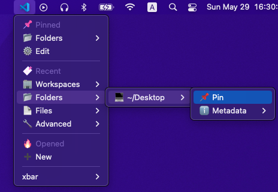

# VSCode history plugin for xbar

This [xbar](https://github.com/matryer/xbar) plugin allows you to display the history of [VSCode](https://code.visualstudio.com/) activities in the menu bar.



## Features

- Show the history of VSCode activities.
  - Clicking on a menu item launches a VSCode window based on its history.
- Pin the history item to the xbar menu.
  - The pinned entries are stored separately from the VSCode history.
  - You can edit the appearance of the pinned entries (including order, icon, label text, destination file/folder/workspace/uri).

## Install

Install [xbar](https://github.com/matryer/xbar). Then install the plugin script:
```sh
$ cd ~/Library/Application\ Support/xbar/plugins
$ curl -O https://raw.githubusercontent.com/fuzmish/xbar-plugins/main/vscode-history/vscode-history-plugin.py
$ chmod +x vscode-history-plugin.py
```

## Technical details

This plugin is heavily dependent on the undocumented behavior of VSCode. Future updates may break this plugin completely. At this moment, this plugin has been tested under the following conditions:
<details>

- Hardware:
  ```
  Model Identifier:	MacBookPro18,3
  System Firmware Version:	7459.121.3
  OS Loader Version:	7459.121.3
  ```
- macOS
  ```
  System Version:	macOS 12.4 (21F79)
  Kernel Version:	Darwin 21.5.0
  ```
- VSCode:
  ```
  Version: 1.67.2
  Commit: c3511e6c69bb39013c4a4b7b9566ec1ca73fc4d5
  Date: 2022-05-17T18:20:04.972Z
  Electron: 17.4.1
  Chromium: 98.0.4758.141
  Node.js: 16.13.0
  V8: 9.8.177.13-electron.0
  OS: Darwin arm64 21.5.0
  ```
- VSCode Insiders
  ```
  Version: 1.68.0-insider
  Commit: 6428d0fc7dae5801cdaf2d160ac39a3dfc8f0c06
  Date: 2022-05-27T05:29:22.985Z
  Electron: 17.4.4
  Chromium: 98.0.4758.141
  Node.js: 16.13.0
  V8: 9.8.177.13-electron.0
  OS: Darwin arm64 21.5.0
  ```
- Python
  ```
  $ python3 -V
  Python 3.8.9
  ```
- [xbar (v2.1.7-beta)](https://github.com/matryer/xbar/releases/tag/v2.1.7-beta)

</details>

### Supported URI types

Each VSCode window has a unique identifier called the Folder URI. The activity history is stored with this URI, and can be called from the command line as `code --folder-uri <uri>` to open the specified VSCode window. The following table shows the URI formats currently recognized by this plugin:

|&nbsp;&nbsp;Icon&nbsp;&nbsp;|Type|Scheme|Details|
|:--:|----|------|-------|
|💻|Local|`file://...`|The entry type corresponds to a local file or directory.
|🐋|Container|`vscode-remote://attached-container+...`|This entry type corresponds to a VSCode session attached to a Docker container using the [Remote - Containers](https://marketplace.visualstudio.com/items?itemName=ms-vscode-remote.remote-containers) extension.|
|📦|DevContainer|`vscode-remote://dev-container+...`|This entry type corresponds to a [DevContainer](https://code.visualstudio.com/docs/remote/containers) session using the [Remote - Containers](https://marketplace.visualstudio.com/items?itemName=ms-vscode-remote.remote-containers) extension.|
|🔌|SSH|`vscode-remote://ssh-remote+...`|This entry type corresponds to a VSCode session connected to an external server using the [Remote - SSH](https://marketplace.visualstudio.com/items?itemName=ms-vscode-remote.remote-ssh) extension.|
|🐋🔌|Container over SSH|`vscode-remote://attached-container+{settings.host: "ssh://..."}...`|This entry type corresponds to a VSCode session attached to a Docker container running on a server connected via SSH.|
|📦🔌|DevContainer over SSH|`vscode-remote://dev-container+{settings.host: "ssh://..."}...`|This entry type corresponds to a DevContainer session running on a server connected via SSH.|

This interpretation is performed by the `create_entry_from_uri` function.

### Entry types

The following types of history entries stored in VSCDB are supported by this plugin:

|Icon|Type|Details|
|:--:|----|-------|
|📄|File|This type of history entry has the `fileUri` property. If you open VSCode using this kind of URI, no directories will be opened.|
|📂|Folder|This type of history entry has the `folderUri` property. If you open VSCode using this kind of URI, the corresponding directory will be opened.|
|🏢|Workspace|This type of history entry has the `workspace` property, and the sub-property `configPath` contains the path to the workspace configuration file (`.code-workspace`). If you open VSCode using this kind of URI, the corresponding workspace will be opened.|

This interpretation is performed by the `load_vsc_history` function.

## Contributing

[GitHub](https://github.com/fuzmish/xbar-plugins)

## License

[MIT License](https://github.com/fuzmish/xbar-plugins/blob/main/LICENSE)
